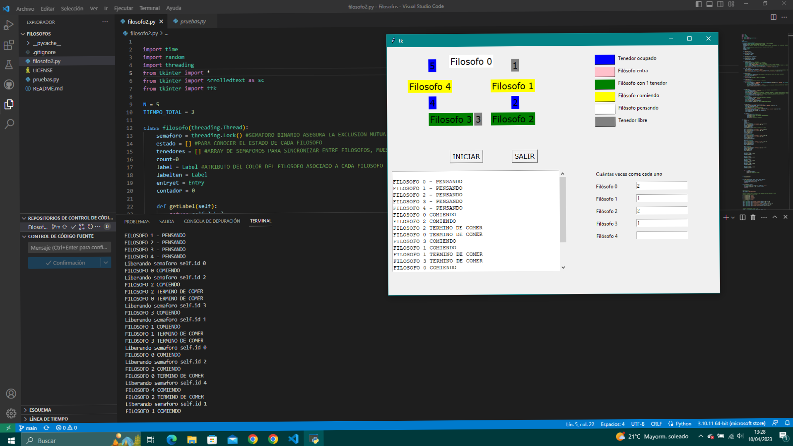

# Filosofos

La dirección de GitHub de este repositorio es la siguiente: 
[GitHub](https://github.com/AnaLopezP/Filosofos.git)
https://github.com/AnaLopezP/Filosofos.git

Código:
```

import time
import random
import threading
from tkinter import *
from tkinter import scrolledtext as sc
from tkinter import ttk

N = 5
TIEMPO_TOTAL = 3

class filosofo(threading.Thread):
    semaforo = threading.Lock() #SEMAFORO BINARIO ASEGURA LA EXCLUSION MUTUA
    estado = [] #PARA CONOCER EL ESTADO DE CADA FILOSOFO
    tenedores = [] #ARRAY DE SEMAFOROS PARA SINCRONIZAR ENTRE FILOSOFOS, MUESTRA QUIEN ESTA EN COLA DEL TENEDOR
    count=0
    label = Label #ATRIBUTO DEL COLOR DEL FILOSOFO ASOCIADO A CADA FILOSOFO
    labelten = Label
    entryet = Entry
    contador = 0
    
    def getLabel(self):
        return self.label
    
    def setLabel(self, label):
        self.label = label

    def setLabelten(self, labelten):
        self.labelten = labelten

    def setEntryet(self, entryet):
        self.entryet = entryet

    def __init__(self):
        super().__init__()      #HERENCIA
        self.id=filosofo.count #DESIGNA EL ID AL FILOSOFO
        filosofo.count+=1 #AGREGA UNO A LA CANT DE FILOSOFOS
        filosofo.estado.append('PENSANDO') #EL FILOSOFO ENTRA A LA MESA EN ESTADO PENSANDO
        filosofo.tenedores.append(threading.Semaphore(0)) #AGREGA EL SEMAFORO DE SU TENEDOR( TENEDOR A LA IZQUIERDA)
        print("FILOSOFO {0} - PENSANDO".format(self.id))
        scroll.insert(index=INSERT, chars = "\nFILOSOFO {0} - PENSANDO".format(self.id))
        
    def __del__(self):
        self.labelten[self.id].config(bg = "gray")
        print("FILOSOFO {0} - Se para de la mesa".format(self.id))  #NECESARIO PARA SABER CUANDO TERMINA EL THREAD
        scroll.insert(index=INSERT, chars = "\nFILOSOFO {0} - Se para de la mesa".format(self.id))
        

    def pensar(self):
        time.sleep(random.randint(0,5)) #CADA FILOSOFO SE TOMA DISTINTO TIEMPO PARA PENSAR, ALEATORIO
        self.label.config(bg="white")

    def derecha(self,i):
        return (i-1)%N #BUSCAMOS EL INDICE DE LA DERECHA

    def izquierda(self,i):
        return(i+1)%N #BUSCAMOS EL INDICE DE LA IZQUIERDA

    def verificar(self,i):
        if filosofo.estado[i] == 'HAMBRIENTO' and filosofo.estado[self.izquierda(i)] != 'COMIENDO' and filosofo.estado[self.derecha(i)] != 'COMIENDO':
            filosofo.estado[i]='COMIENDO'
            self.labelten[self.id].config(bg = "gray")
            filosofo.tenedores[i].release()  #SI SUS VECINOS NO ESTAN COMIENDO AUMENTA EL SEMAFORO DEL TENEDOR Y CAMBIA SU ESTADO A COMIENDO
            print("Liberando semaforo self.id " + str(i))
            
            
        
    def tomar(self):
        filosofo.semaforo.acquire() #SEÑALA QUE TOMARA LOS TENEDORES (EXCLUSION MUTUA)
        filosofo.estado[self.id] = 'HAMBRIENTO'
        self.label.config(bg="green")
        self.verificar(self.id) #VERIFICA SUS VECINOS, SI NO PUEDE COMER NO SE BLOQUEARA EN EL SIGUIENTE ACQUIRE
        filosofo.semaforo.release() #SEÑALA QUE YA DEJO DE INTENTAR TOMAR LOS TENEDORES (CAMBIAR EL ARRAY ESTADO)
        filosofo.tenedores[self.id].acquire() #SOLO SI PODIA TOMARLOS SE BLOQUEARA CON ESTADO COMIENDO
        self.labelten[self.id].config(bg = "blue")

    def soltar(self):
        filosofo.semaforo.acquire() #SEÑALA QUE SOLTARA LOS TENEDORES
        filosofo.estado[self.id] = 'PENSANDO'
        self.label.config(bg="white")
        self.verificar(self.izquierda(self.id))
        self.verificar(self.derecha(self.id))
        filosofo.semaforo.release() #YA TERMINO DE MANIPULAR TENEDORES
        

    def comer(self):
        print("FILOSOFO {} COMIENDO".format(self.id))
        scroll.insert(index=INSERT, chars = "\nFILOSOFO {} COMIENDO".format(self.id))
        self.label.config(bg="yellow")
        time.sleep(2) #TIEMPO ARBITRARIO PARA COMER
        print("FILOSOFO {} TERMINO DE COMER".format(self.id))
        scroll.insert(index=INSERT, chars = "\nFILOSOFO {} TERMINO DE COMER".format(self.id))
        self.entryet[self.id].delete(0)
        self.entryet[self.id].insert(0, self.contador + 1)
        self.contador += 1

    def run(self):  
        for i in range(TIEMPO_TOTAL):
            self.pensar() #EL FILOSOFO PIENSA
            self.tomar() #AGARRA LOS TENEDORES CORRESPONDIENTES
            self.comer() #COME
            self.soltar() #SUELTA LOS TENEDORES


def main():
    listaet = []
    lista=[]
    listaten = []
    socrates = filosofo()
    fil1 = crear_texto(root, "Filosofo 0", "pink", 150, 20)
    ten1 = crear_texto(root, "1", "gray", 300, 30)
    socrates.setLabel(fil1)
    listaten.append(ten1)
    lista.append(socrates) #AGREGA UN FILOSOFO A LA LISTA

    platon = filosofo()
    fil2 = crear_texto(root, "Filosofo 1", "pink", 250, 80)
    ten2 = crear_texto(root, "2", "gray", 300, 120)
    platon.setLabel(fil2)
    listaten.append(ten2)
    lista.append(platon)

    aristoteles = filosofo()
    fil3 = crear_texto(root, "Filosofo 2", "pink", 250, 160)
    ten3 = crear_texto(root, "3", "gray", 210, 160)
    listaten.append(ten3)
    aristoteles.setLabel(fil3)
    lista.append(aristoteles)

    descartes = filosofo()
    fil4 = crear_texto(root, "Filosofo 3", "pink", 100, 160)
    ten4 = crear_texto(root, "4", "gray", 100, 120)
    listaten.append(ten4)
    descartes.setLabel(fil4)
    lista.append(descartes)

    marx = filosofo()
    fil5 = crear_texto(root, "Filosofo 4", "pink", 50, 80)
    ten5 = crear_texto(root, "5", "gray", 100, 30)
    listaten.append(ten5)
    marx.setLabel(fil5)
    lista.append(marx)


    e1 = Entry(root)
    e1.place(x = 600, y = 330)
    listaet.append(e1)

    e2 = Entry(root)
    e2.place(x = 600, y = 360)
    listaet.append(e2)

    e3 = Entry(root)
    e3.place(x = 600, y = 390)
    listaet.append(e3)

    e4 = Entry(root)
    e4.place(x = 600, y = 420)
    listaet.append(e4)

    e5 = Entry(root)
    e5.place(x = 600, y = 450)
    listaet.append(e5)


    for f in lista:
        f.setLabelten(listaten)
        f.setEntryet(listaet)
        f.start() #ES EQUIVALENTE A RUN()


def cerrar_ventana():
    root.destroy()
    

def crear_texto(ventana, texto, color, poscol, posfil):
    a = Label(ventana, text = texto, bg = color)
    a.place(x = poscol, y = posfil)
    a.config(font= ("Verdana", 16))
    return a

def rectangulo(y, color):
    jj = Canvas(width= 50, height= 25, background="white")
    jj.place(x = 500, y = y)
    jj.create_rectangle(0, 0, 50, 25, fill = color)
    return jj


#CREO LA VENTANA
root = Tk()
root.geometry("800x600+560+240")

#CREO LAS ETIQUETAS DE LOS FILOSOFOS Y LOS TENEDORES QUE IRÁN CAMBIANDO DE COLOR
#CREO LOS RECTÁNGULOS DE LA LEYENDA
a = rectangulo(20, "blue")
b = rectangulo(50, "pink")
c = rectangulo(80, "green")
d = rectangulo(110, "yellow")
e = rectangulo(140, "white")
f = rectangulo(170, "gray")

#CREO LA LEYENDA
texa = Label(root, text= "Tenedor ocupado").place(x = 555, y = 20)
texb = Label(root, text= "Filósofo entra").place(x = 555, y = 50)
texc = Label(root, text= "Filósofo con 1 tenedor").place(x = 555, y = 80)
texd = Label(root, text= "Filósofo comiendo").place(x = 555, y = 110)
texe = Label(root, text= "Filósofo pensando").place(x = 555, y = 140)
texf = Label(root, text= "Tenedor libre").place(x = 555, y = 170)


#CREO EL RECUADRO DONDE ESTARÁ EL LOG
scroll = sc.ScrolledText(root, width = 50, height = 15)
scroll.place(x = 10, y = 300)

#CREO LA RECOPILACIÓN DE CUÁNTAS VECES COME CADA UNO
reg = Label(root, text = "Cuántas veces come cada uno")
reg.place(x = 500, y =300)
f1 = Label(root, text= "Filósofo 0").place(x = 500, y = 330)
f2 = Label(root, text= "Filósofo 1").place(x = 500, y = 360)
f3 = Label(root, text= "Filósofo 2").place(x = 500, y = 390)
f4 = Label(root, text= "Filósofo 3").place(x = 500, y = 420)
f5 = Label(root, text= "Filósofo 4").place(x = 500, y = 450)


#CREO LOS BOTONES DE INICAR Y QUITAR
iniciar = Button(root, text= "INICIAR", command= main)
iniciar.place(x = 150, y = 250)
iniciar.config(font= ("Verdana", 12))


finalizar = Button(root, text= "SALIR", command= cerrar_ventana)
finalizar.place(x = 300,  y = 250)
finalizar.config(font= ("Verdana", 12))

root.mainloop()
```

#CAPTURA DEL RESULTADO

